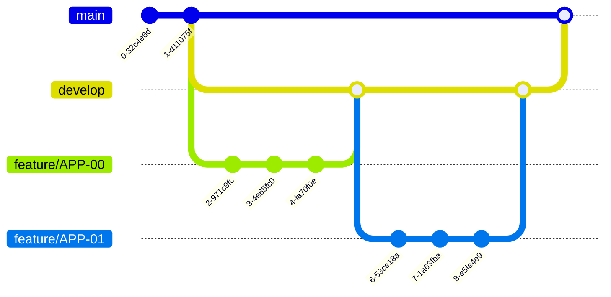

# 시대생 클라이언트

- **UOSLIFE Native Client with React Native**

# 개발 환경 설정

## Install Dependencies

- 시대생 팀은 패키지 매니저로 **yarn 3**을 사용합니다.

```bash
$ yarn install
```

## Running Development

```bash
$ yarn start
```

- iOS: Xcode

```bash
$ yarn ios
```

- Android: Android Studio

```bash
$ yarn android --variant=alphaDebug
```

## Setting Environment Variables

- 초기 설정 시 **환경 변수 설정**이 필요합니다.
- 시대생 노션의 [해당 페이지](https://www.notion.so/ab38890063264a17946db59a653d95c0?pvs=4)에서 확인하실 수 있습니다.

# How to Work?

- 작업할 내용에 대한 issue를 생성합니다. 이슈 제목 양식은 **[APP-00] (title)** 입니다.
- **develop 브랜치**에서 **작업용 브랜치**를 만들어 그 브랜치에서 작업을 진행합니다.
- 이때, 작업용 브랜치명은 이슈에서 생성한 **APP-00** 입니다.
- 작업을 진행한 브랜치에서 **develop** 브랜치로 향하는 Pull Request를 생성합니다.

## Git Flow

- 배포가 필요한 경우, [해당 workflow](https://github.com/uoslife/uoslife-client/actions/workflows/release.yaml)로 AppCenter에서 Codepush 배포가 가능합니다.



# Project Maintainers

- **공은배** | [@eunbae0](https://github.com/eunbae0)
- **김영찬** | [@ratafa](https://github.com/ratafa)
- **송채희** | [@Chaehee03](https://github.com/Chaehee03)
- **이준수** | [@adrinerDP](https://github.com/adrinerDP)
- **임어진** | [@limeojin363](https://github.com/limeojin363)
